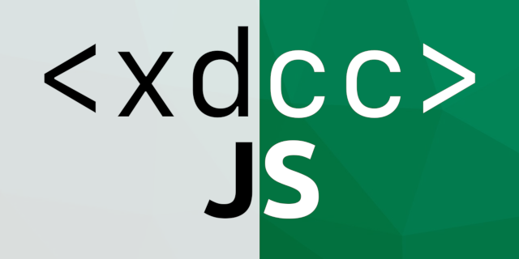

<h1 align="center"> <br> <a href="https://snyk.io/test/github/JiPaix/xdccJS?targetFile=package.json"></a> <a href="https://www.npmjs.com/package/xdccjs"></a> <br><a href="https://www.codefactor.io/repository/github/jipaix/xdccjs"></a> <a href="https://codeclimate.com/github/JiPaix/xdccJS/maintainability"></a> <a href="https://deepscan.io/dashboard#view=project&tid=8945&pid=11179&bid=163106"> <a href="https://discord.gg/HhhqdUd"></a></h1>

### Features :
***xdccJS is a complete implementation of the <a href="https://en.wikipedia.org/wiki/XDCC">XDCC protocol</a> for nodejs***.  
It can also be used as a <a href="#command-line-interface">command-line</a> downloader !  
- Batch downloads : `1-3, 5, 32-35, 101`
- Resume file and auto-retry
- Pipes!
- [Passive DCC](https://en.wikipedia.org/wiki/Direct_Client-to-Client#Passive_DCC)
- Check [advanced examples](https://github.com/JiPaix/xdccJS/tree/master/examples) and see what else you can do

## Table of contents
- [API](#api)
  - [Import and Require](#importrequire)
  - [Configuration](#configuration)
  - [Download](#download)
    - [jobs](#Jobs)
    - [events](#Events)
    - [use pipes](#Pipes)
  - [(Auto) disconnect from IRC](#disconnect)
  - [Advanced IRC commands](#advanced-irc-commands)
- [CLI](#command-line-interface)
  - [Installation](#installation-1)
  - [Options](#options)
  - [Download](#download-1)
  - [Profiles](#profiles)
  - [Important notes](#fyi)

# Installation
[](https://nodei.co/npm/xdccjs/)
# API
## Import/require
```js
const XDCC = require('xdccjs').default
// or
import XDCC from 'xdccjs'
```
## Configuration

**Minimal configuration :** 
```js
let opts = {
  host: 'irc.server.net', // will use default port 6667
  path: '/my/download/folder' // absolute and relative paths both work
}

const xdccJS = new XDCC(opts)
```
**Advanced configuration :**
Except for `host` every parameter is optional, but you can also define a set of options to your preference :  

```js
const opts = {
  host: 'irc.server.net', // IRC hostname                                                   - required
  port: 6660, // IRC port                                                                   - default: 6667
  nickname: 'ItsMeJiPaix', // Nickname                                                          - default: xdccJS + random
  chan: ['#candy', '#fruits'], // Array of channels                                         - default : [ ]
  path: 'downloads', // Download path or 'false'                                            - default: false (which enables piping)
  retry: 2, // Nb of retries before skip                                                    - default: 1
  timeout: 50, // Nb of seconds before a download is considered timed out                   - default: 30
  verbose: true, // Display download progress and jobs status                               - default: false
  randomizeNick: false, // Add random numbers at end of nickname                            - default: true
  passivePort: [5000, 5001, 5002], // Array of port(s) to use with Passive DCC              - default: [5001]
  secure: false, // Allow/Deny files sent by bot with different name than the one requested - default: true
}
```

## Download
>xdccJS.**download( bot** : string, **packets** : string | number | number[] **)**
```js
xdccJS.on('ready', () => {
  xdccJS.download('XDCC|BLUE', '1-3, 8, 55')
  xdccJS.download('XDCC|YELLOW', 4)
  xdccJS.download('XDCC|RED', [12, 7, 10, 20])
  xdccJS.download('XDCC|PURPLE', ['1', '3', '10', '20'])
})
```
### Jobs
**.download() are stored as jobs**
```js
const job1 = xdccJS.download('a-bot', [33, 50, 62, 98])
const job2 = xdccJS.download('XDCC|RED', [1, 3, 10, 20])
```
#### Jobs offer three options :
- Get job progress status :
  ```js
  let status = job1.show()
  console.log(status)
  //=> { name: 'a-bot', queue: [98], now: 62, sucess: ['file.txt'], failed: [50] }
  ```
- Cancel a Job
  ```js
  job1.cancel()
  ```
- Events (see [events documentation](#Events))

**Jobs are stored by bot nickname :** `.download()` will update matching jobs
```js
xdccJS.on('ready', () => {
  const job1 = xdccJS.download('XDCC|BLUE', '1-3, 8, 55') // job1 is created
  const job2 = xdccJS.download('XDCC|RED', [1, 3, 10, 20]) // job2 is created
  xdccJS.download('XDCC|BLUE', 23) // job1 is updated
  xdccJS.download('XDCC|RED', '150-155') // job2 is updated
})
```
**You can also search jobs** with :`xdccJS.jobs()`

> xdccJS.**jobs( bot** : string | undefined **)**

```js
// find job by botname
const job = xdccJS.jobs('bot-name')

// retrieve all jobs at once
const arrayOfJobs = xdccJS.jobs()
```

### Events
**Most events are accessible both from xdccJS or a Job scope**

*FYI: those examples are for the sake of showing xdccJS capabilities, if you need download status to be displayed in a nice way just start xdccJS with parameter `verbose = true`*
 

> [**xdccJS**].on( **'ready'** ) : *xdccJS is ready to download*
  - ```js
    xdccJS.on('ready', ()=> {
      // download() here
    })
    ```
> [**xdccJS** | **Job**].on( **'downloading'** ) : *Data is being received (a file is downloading)*
  - ```js
    xdccJS.on('downloading', (fileInfo, received, percentage) => {
      console.log(fileInfo) //=> { file: 'filename.pdf', filePath: '/path/to/filename.pdf', length: 5844849 }
      console.log(`downloading: '${fileInfo.file}'`) //=> downloading: 'your file.pdf'
    })

    job.on('downloading', (fileInfo, received, percentage) => {
      console.log(percentage) //=> 10.55
    })
    ```
> [**xdccJS** | **Job**].on( **'downloaded'** ) : *A file successfully downloaded*
  - ```js
    xdccJS.on('downloaded', (fileInfo) => {
      console.log(fileInfo.filePath) //=> /home/user/xdccJS/downloads/myfile.pdf
    })

    job.on('downloaded', (fileInfo) => {
      console.log('Job1 has downloaded:' + fileInfo.filePath)
      //=> Job1 has downloaded: /home/user/xdccJS/downloads/myfile.pdf
      console.log(fileInfo)
      //=> { file: 'filename.pdf', filePath: '/home/user/xdccJS/downloads/myfile.pdf', length: 5844849 }
    })
    ```
> [**xdccJS** | **Job**].on( **'done'** ) : *A job has no remaining package in queue*
  - ```js
    xdccJS.on('done', (job) => {
      console.log(job.show())
        //=> { name: 'a-bot', queue: [98], now: 62, sucess: ['file.txt'], failed: [50] }
    })

    job.on('done', (job) => {
      console.log('Job2 is done!')
      console.log(job.show())
        //=> { name: 'a-bot', queue: [98], now: 62, sucess: ['file.txt'], failed: [50] }
    })
    ```
> [**xdccJS** | **Job**].on( **'pipe'** ) : *A pipe is available (see [pipe documentation](#pipes)*)
  - ```js
    xdccJS.on('pipe', (stream, fileInfo) => {
      stream.pipe(somewhere)
      console.log(fileInfo)
      //=> { file: 'filename.pdf', filePath: 'pipe', length: 5844849 }
    })

    job.on('pipe', (stream, fileInfo) => {
      stream.pipe(somewhere)
      console.log(fileInfo)
      //=> { file: 'filename.pdf', filePath: 'pipe', length: 5844849 }
    })
    ```
> [**xdccJS** | **Job**].on( **'error'** ) : *something goes wrong*
  - ```js
    xdccJS.on('error', (message) => {
      console.log(message)
      //=> timeout: no response from XDCC|BLUE
    })

    job.on('error', (message) => {
      //=> timeout: no response from XDCC|BLUE
    })
    ```

### Pipes
In order to use pipes xdccJS need to be initialized with path option set to false
```js
// This example will start vlc.exe then play the video while it's downloading.
const opts = {
  host: 'irc.server.net',
  path: false, 
}

const xdccJS = new XDCC(opts)

// Start VLC
const { spawn } = require('child_process')
const vlcPath = path.normalize('C:\\Program Files\\VideoLAN\\VLC\\vlc.exe')
const vlc = spawn(vlcPath, ['-'])

xdccJS.on('ready', () => {
  const Job = xdccJS.download('bot', 155)
})

// send data to VLC that plays the file
Job.on('pipe', stream => {
  stream.pipe(vlc.stdin)
})
```
## Disconnect
```js
// event triggered when all jobs are done.
xdccJS.on('can-quit', () => {
  xdccJS.quit() // this is how you disconnect from IRC
})
```
## Advanced IRC commands
**xdccJS uses [@kiwiirc/irc-framework](https://github.com/kiwiirc/irc-framework)** client which is **entirely** accessible via the `irc` property.  
Check their client API [documentation](https://github.com/kiwiirc/irc-framework/blob/master/docs/clientapi.md)
```js
// middlewares
xdccJS.irc.use(middleware)

xdccJS.on('ready', () => {
  // change nickname
  xdccJS.irc.changeNick('new-nickname')
  // listen to kick events
  xdccJS.irc.on('kick', (info) => {
    //=> do something..
  })
})
```
An extended version of this example is available [here](/examples/irc-framework.js)
# Command-line Interface
## Installation
```bash
npm install xdccjs -g
```  
## Options
```
Options:
  -V, --version              output the version number
  -h, --host <server>        IRC server hostname
  --port <number>            IRC server port
  -b, --bot <botname>        xdcc bot nickname
  -d, --download <packs...>  pack number(s) to download
  -p, --path <path>          download path
  -n, --nickname <nickname>  Your IRC nickname
  -c, --channel [chan...]    channel(s) to join (without #)
  -r, --retry <number>       number of attempts before skipping pack
  -q, --quiet                disable console output
  --passive-port <number>    port used for passive dccs
  --no-randomize             Disable nickname randomization
  -w, --wait [number]        wait time (in seconds) in channel(s) before sending download request (default: 0)
  --no-secure                Allow files sent by bot with different name than the one requested
  --save-profile [string]    save current options as a profile
  --delete-profile [string]  delete profile
  --set-profile [string]     set profile as default
  --list-profile             list all available profiles
  --help                     display help for command
```
## Download 
**I recommend using double quotes between the `bot name` and `download path`** as they often both include unescaped characeters or whitespaces
```bash
xdccJS --host irc.server.net --bot "XDCC-BOT|BLUE" --download 1-5,100-105 --path "/home/user/downloads"
```  
Alternatively, if you want to pipe the file just ommit the `--path` option  :  
```bash
xdccJS --host irc.server.net --bot "XDCC-BOT|RED" --download 110 | vlc -
```
## Profiles
Profiles are presets of options.
### Save
You can save options as a profile with `--save-profile` :
```bash
# Any option can be included
xdccJS --save-profile "my_profile" --host "irc.server.net" --port "6669" --path "C:/Users/JiPaix/Desktop"
```
### Use
```bash
#1 - standard
xdccJS --bot "XDCC|BOT" --download "1132-1137"

#2 - if your profile includes a bot name
xdccJS --download "1132-1137"

#3 - use a different path than the one provided by current profile
xdccJS --bot "XDCC|BOT" --download "1132-1137" --path "E:/external_disk"

#4 - standard + copy/paste
xdccJS "/msg XDCC|BOT xdcc send 1132-1337" # quotes are important here
```
### Set default
set default profile :
```bash
xdccJS --set-profile another_profile
```
### List
List all profiles :
```bash
xdccJS --list-profile
```
### Delete
Delete a profile :
```bash
xdccJS --del-profile my_profile
```
## FYI
- hashtags for channels and packs are optional :
  - ```bash
      --channel "#my-channel" --download "#132"
      # is the same as
      --channel "my-channel" --download "132" 
    ```
- given options prevails over the one provided by profiles :
  - except for `--host`, which results in xdccJS ignoring the current profile
  - example: 
    ```bash
        # current profile has --wait 5, but this time you need --wait 50
        xdccJS --bot "mybot" --download "125-130" --wait 50
      ```
    ```bash
        # ignores ALL profile options
        xdccJS --host "irc.mywnewserver.org"
- options `--bot` and `--path` often contains special characters and/or whitespaces :
  - ```bash
      # this wont work
      --path /home/user/my folder --bot XDCC|BOT --download 123-125
      # fixed
      --path "/home/user/my folder" --bot "XDCC|BOT" --download 123-125 
    ```

## Documentation
Full documentation is available <a href="https://jipaix.github.io/xdccJS/classes/xdcc.html">here</a>
